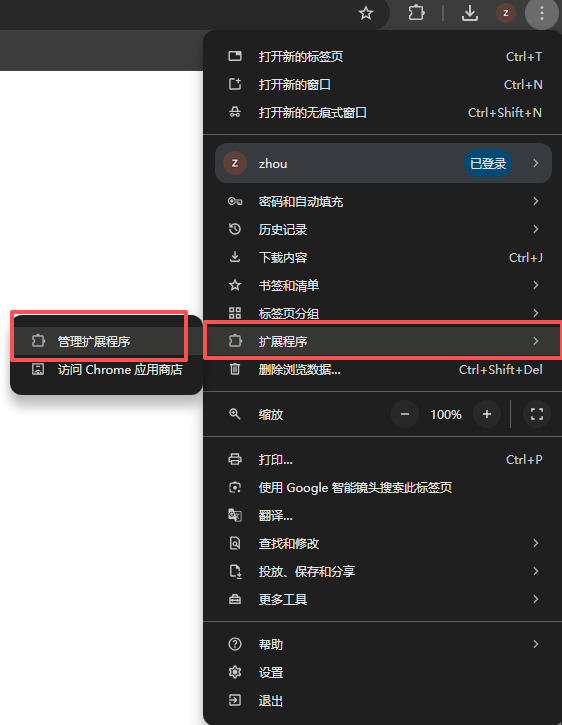
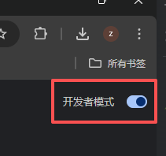
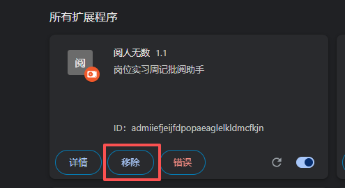
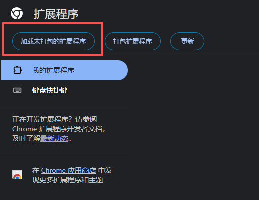
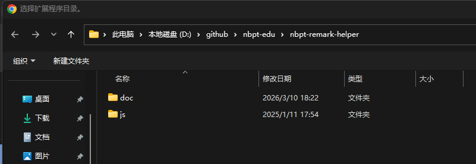
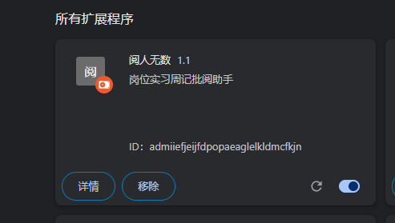
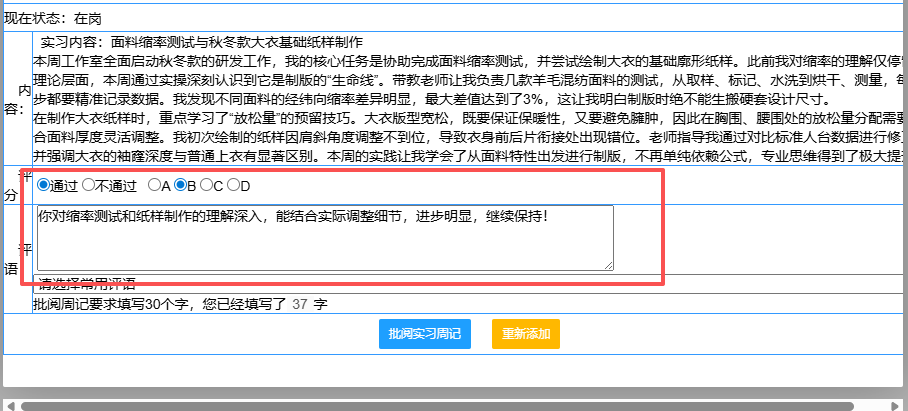

# 岗位实习批阅小助手

## 注意

此插件需要安装在Chrome浏览器中，因此您必须先安装Chrome浏览器，才能使用此插件。

## 安装步骤

1. 打开Chrome浏览器的插件页面

2. 打开**开发者模式**

3. 检查是否有老版本的插件，若有，则先移除；若无，则继续下一步

4. 点击**加载未打包的扩展程序**，路径选择本插件的解压路径

5. 在**所有扩展程序**中检查是否安装成功

6. 重新打开岗位实习平台，验证插件是否工作正常(第一次打开会闪退，正常现象，重新打开岗位实习平台即可)。若正常，则会在批阅框内实现自动批阅功能，插件默认评分为**通过**，**等级**为B，**评语**会根据根据内容自动生成

## 写在最后

周记是指导老师了解实习同学的重要方式，插件仅能辅助您完成周记批阅功能，减少您打字的辛苦。您仍需认真阅读周记，关注学生的实习状态，关心学生的心理健康，且不可因AI而失初心！！！

祝您使用愉快。

--------

阅人无数 ©2026 yaphone. All rights reserved.

